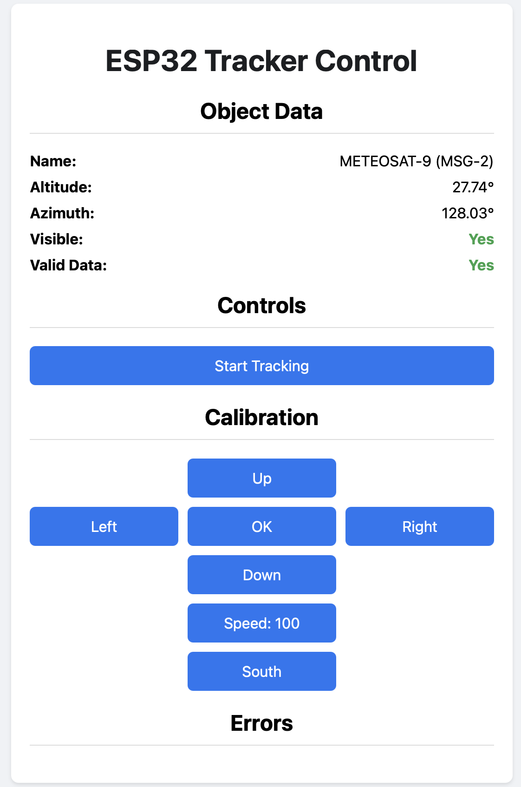

# Introduction

This is my Rotor project.  
It is an ESP32 based Rotor controller that connects with Stellarium and can track objects.  
I'm using this with my SDR Antenna to track Satellites.

# How does it work

The ESP32 creates an Access Point and is a webserver at the same time.
With your Laptop running Stellarium make sure the Remote Control Plugin is activated with the default port (8090) without username and password.
Connect your Laptop to the Access Point and open a webbrowser and goto http://192.168.4.1 here you will see the controller.

When you are connected and Stellarium is running and an object is selected you should see the name of the object and it's location in your browser.
You will need to have Stellarium in you active window for the tracking to work, otherwise Stellarium will not update the object position.
So I end up with my browser and Stellarium side-by-side in one window.

# Settings config.ini

All required settings are set in the config.ini file, which needs to be uploaded to your ESP32
When using PlatformIO use "Build File System" and "Upload File System Image", this is required anyway to also upload the index.html file.

Most parameters in the .ini file are self explainatory, hence we'll focus on the servo settings here.
There are 2 servo's: an Azimuth and an Altitude servo.

## Servo settings

<pre>
SERVO_ALT_DEGREES   = 180       // Most servo's have a range of 180 degrees  
SERVO_ALT_MIN       = 500       // Min pulse of servo  
SERVO_ALT_MAX       = 2500      // Max pulse of servo  
SERVO_ALT_OFFSET    = 0.0       // When you have an offset antenna/dish, the offset in degrees  
SERVO_ALT_DIRECTION = 1         // Well the direction, some more the other way around, depending on your physical build  
SERVO_ALT_SMOOTH    = 0         // When 1 the servo's move gradually, this is recommended for large heavy antenna's  
  
SERVO_AZ_DEGREES    = 270       // Most servo's have a range of 180 degrees, I've chosen a 270 degrees servo for my Azimuth  
SERVO_AZ_MIN        = 500       // See above  
SERVO_AZ_MAX        = 2500      // See above  
SERVO_AZ_DIRECTION  = -1        // See above  
SERVO_AZ_SMOOTH     = 0         // See above  
</pre>

# Build

All build dependancies are in the platformio.ini file.  
Building using PlaformIO should be straightforward.

# Running the application and calibration

Once the ESP32 is running:
1. Connect your laptop to the Access Point.
2. Make sure that Stellarium is running on your laptop and that the Stellarium Remote Control Plug-in is activated on port 8090 without Username and Password.
3. Visit the Control Pannel (http://192.168.4.1) in your web-browser.
  
When you select an object in Stellarium, the name of the object and the ALT/AZ coordinates should be visible in the Control Pannel in your browser. It should be looking someting like this:

The first step is to calibrate the rotor. With the speed, arrow and north/south button angle you antenna exactly horozontally and facing either north or south (depending on the selection), then press "Ok'. The Rotor is calibrated now.
  
If an object is selected use the "Start Tracking" button to track the object.
In this tracking mode you can make calibration adjustments by using the Speed/Arrow buttons.
  
Happy tracking!

# Problem solving

The onboard led is used for 2 error conditions. See below.

## Serious Halt
When the led blinks very fast, there is a serious problem (couldn't mount SPIFFS) and the program halts.  
You will have to do some debugging :-(  
It would be good to let me know as well when this happens.  

## Slow blink
1 second on, and 2 second off.  
No worries, there is no connection to the Access Point or no connection to Stellarium, just go and fix this.

# Additional Info

I'm using my own implementation of a Servo class, since I couldn't get ESP32Servo.h to work.

# Remarks

Will be completed later after the development is more mature.
Later on I'll make a seperate directory to outline the physical build as well.
